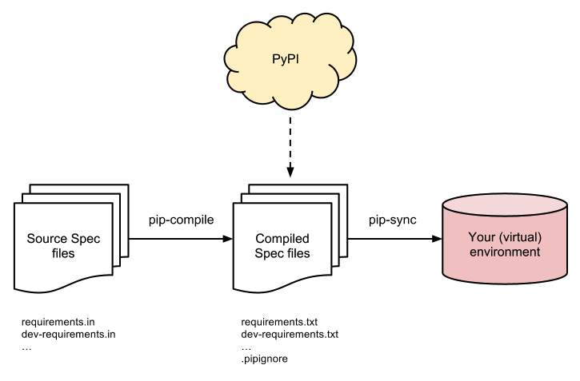

[](https://travis-ci.org/jazzband/pip-tools)
[](https://jazzband.co/)

pip-tools = pip-compile + pip-sync
==================================

A set of command line tools to help you keep your `pip`-based packages fresh,
even when you've pinned them.  [You do pin them, right?][0]



[0]: http://nvie.com/posts/pin-your-packages/


Installation
============

```console
$ pip install --upgrade pip  # pip-tools needs pip==8.0 or higher (!)
$ pip install pip-tools
```


Example usage for `pip-compile`
===============================

Requirements from setup.py
--------------------------

Suppose you have a Flask project, and want to pin it for production.  If you have a `setup.py` with
`install_requires=['Flask']`, then run `pip-compile` without any arguments:
```console
$ pip-compile
#
# This file is autogenerated by pip-compile
# To update, run:
#
#    pip-compile --output-file requirements.txt setup.py
#
flask==0.10.1
itsdangerous==0.24        # via flask
jinja2==2.7.3             # via flask
markupsafe==0.23          # via jinja2
werkzeug==0.10.4          # via flask
```

`pip-compile` will produce your `requirements.txt`, with all the Flask dependencies
(and all underlying dependencies) pinned.  You should put your requirements file under version control.

Without setup.py
----------------

If you don't use `setup.py` ([it's easy to write one][1]), you can instead write the following line to a file:

    # requirements.in
    Flask

This time, run `pip-compile requirements.in`:

```console
$ pip-compile requirements.in
#
# This file is autogenerated by pip-compile
# To update, run:
#
#    pip-compile --output-file requirements.txt requirements.in
#
flask==0.10.1
itsdangerous==0.24        # via flask
jinja2==2.7.3             # via flask
markupsafe==0.23          # via jinja2
werkzeug==0.10.4          # via flask
```

And it will produce your `requirements.txt`, with all the Flask dependencies
(and all underlying dependencies) pinned.  Don't forget to put this file under version control as well.

[1]: https://packaging.python.org/distributing/#configuring-your-project

Updating requirements
---------------------

To update all packages, periodically re-run `pip-compile --upgrade`.

To update a specific package to the latest or a specific version use the `--upgrade-package` or `-P` flag:

```console
$ pip-compile --upgrade-package flask  # only update the flask package
$ pip-compile --upgrade-package flask --upgrade-package requests  # update both the flask and requests packages
$ pip-compile -P flask -P requests==2.0.0  # update the flask package to the latest, and requests to v2.0.0
```

If you use multiple Python versions, you can run ``pip-compile`` as ``py -X.Y
-m piptools compile ...`` on Windows and ``pythonX.Y -m piptools compile ...``
on other systems.

Example usage for `pip-sync`
============================

Now that you have a `requirements.txt`, you can use `pip-sync` to update your
virtual env to reflect exactly what's in there.  Note: this will
install/upgrade/uninstall everything necessary to match the `requirements.txt`
contents.

```console
$ pip-sync
Uninstalling flake8-2.4.1:
  Successfully uninstalled flake8-2.4.1
Collecting click==4.1
  Downloading click-4.1-py2.py3-none-any.whl (62kB)
    100% |████████████████████████████████| 65kB 1.8MB/s
  Found existing installation: click 4.0
    Uninstalling click-4.0:
      Successfully uninstalled click-4.0
Successfully installed click-4.1
```

To sync multiple `*.txt` dependency lists, just pass them in via command line arguments e.g.:
```shell
$ pip-sync dev-requirements.txt requirements.txt
```
Passing in empty arguments would cause it to default to `requirements.txt`.

If you use multiple Python versions, you can run ``pip-sync`` as ``py -X.Y -m
piptools sync ...`` on Windows and ``pythonX.Y -m piptools sync ...`` on other
systems.
